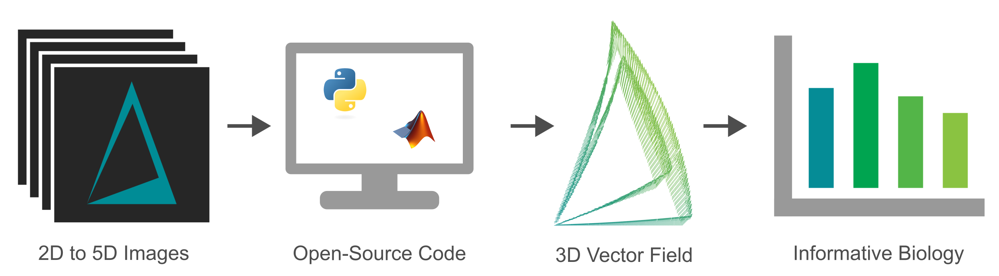

# OpticalFlow3D 

Biological structures are often amorphous and difficult-to-segment, making it a challenge to characterize their complex motion.  Optical flow can measure voxel-scale motion, providing a flexible tool for measuring a variety of biological structures over time. This repository contains  three-dimensional optical flow implementations in both Python and MATLAB and provides guidance on using these tools.



## Usage Overview

Usage details and dependencies for each implementation are available in the individual README files in the [Python](src/Python/) and [MATLAB](src/MATLAB/) folders. Briefly, each implementation contains:

- A function to calculate optical flow on a minimal set of time points. For each input time point, individual, double-precision tif files for $v_x$, $v_y$, $v_z$, and reliability are created. See [Background](#background-lucas-kanade-optical-flow) for more information.
- A function that can parse a time lapse in tif format for input to the optical flow function. The input tif files can be in the format of a multi-page tif with ImageJ metadata or a series of tif files with a regular expression for time.
- An example script for processing a time lapse to illustrate usage of the optical flow functions.
- An example script for analyzing the output of the pipeline.

### Optical Flow Parameters

File parsing requires four parameters:

- The full path to the directory containing the images to be processed.
- The name of the multi-page tif to process OR a regular expression for an image series.
- The file type: 'OneTif' for a multi-page tif or 'SequenceT' for an image series.
- The number of spatial dimensions (2 or 3).

The flow calculation requires three parameters, each related to smoothing of the resulting flow fields. For all three parameters, larger values remove noise at the loss of detailed resolution.

- `xyzSig` sets a sigma for Gaussian smoothing in all three spatial dimensions.
- `tSig` sets a sigma for Gaussian smoothing in time. A minimal set of time points for the flow calculation for one frame is $6 \times tSig+1$ . The first and last $3 \times tSig$ time points from each time lapse are excluded to avoid edge effects.
- `wSig` sets the size of the Lucas-Kanade neighborhood (see [Background](#background-lucas-kanade-optical-flow)), and will lead to smoothing of the flow over this spatial neighborhood size.


## Background: Lucas-Kanade Optical Flow

Optical flow calculations are based on the assumption that brightness is constant. Given this assumption, and a Taylor expansion around small changes, the governing optical-flow equation is:

```math
-\vec{\nabla} I(x,y,z,t) \cdot \vec{v} = \frac{\partial I (x,y,z,t)}{\partial t}
```
The values for $v_x$, $v_y$, and $v_z$ that are calculated from the governing equation reflect all changes in intensity, including translational motion and local intensity changes.

This governing equation is unconstrained. The implementations in this repository use the Lucas-Kanade constraint ([Barron et al., 1994](https://ieeexplore.ieee.org/document/223269?arnumber=223269); [Lucas and Kanade, 1981](https://hal.science/hal-03697340)). This constraint sets a neighborhood (with size controlled by `wSig`) in which all pixels have the same flow vector. 

The Lucas-Kanade constraint allows the flow equation to be solved using a least squares regression. The implementations here implement a Gaussian weight matrix such that those values closest to a point have a larger influence on the calculated flow. As previously described ([Barron et al., 1994](https://ieeexplore.ieee.org/document/223269?arnumber=223269); [Simoncelli, 1991](https://ieeexplore.ieee.org/document/139707)), the eigenvalues derived from this least squares solution can be used as a "reliability" metric for the flow. Reliability values are output as separate tif files by the optical flow function and can be used to remove noise from the downstream analysis.